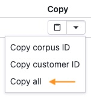

<p align="center">
  
</p>

# JS Widgets

JS Widgets is a collection of Vectara-powered JavaScript widgets that are ready to be embedded on any HTML page.

> [!TIP]
>
> Looking for something else? Try another open-source project:
>
> - **[React-Search](https://github.com/vectara/react-search)**: Add Vectara semantic search to your React apps with a few lines of code.
> - **[React-Chatbot](https://github.com/vectara/react-chatbot)**: Add a Vectara chatbot widget or chat logic to your React apps with a few lines of code.
> - **[Create-UI](https://github.com/vectara/create-ui)**: The fastest way to generate a working React codebase for a range of generative and semantic search UIs.
> - **[Vectara Answer](https://github.com/vectara/vectara-answer)**: Demo app for Summarized Semantic Search with advanced configuration options.
> - **[Vectara Ingest](https://github.com/vectara/vectara-ingest)**: Sample templates and crawlers for pulling data from many popular data sources.

## Usage

### React-Search

Add this script tag to the `<head>` tag of your website:

```
<script src="https://cdn.jsdelivr.net/gh/vectara/js-widgets/lib/js-search.js">
```

Then, at the bottom of your website's `<body>` tag (or in your own JavaScript code), add the following code:

```
  window.vectara.renderSearch({
    wrapperId: "<the id of the container element for your search widget>",
    customerId: "<your Vectara customer ID>",
    corpusId: "<your Vectara corpus ID>",
    apiKey: "<your Vectara query API key>",
    placeholder?: "<optional string placeholder for your search input>",
    isDeepLinkable?: <optional boolean specifying if searches should be deeplinkable (modifies page URL)>,
    openResultsInNewTab?: <optional boolean specifying if clicked results should open in a new tab>
  });
```

### React-Chatbot

Add this script tag to the `<head>` tag of your website:

```
<script src="https://cdn.jsdelivr.net/gh/vectara/js-widgets/lib/js-chatbot.js">
```

Then, at the bottom of your website's `<body>` tag (or in your own JavaScript code), add the following code:

```
  window.vectara.renderChatbot({
    customerId: "<your Vectara customer ID>",
    corpusIds: <an array of Vectara corpus ID strings>,
    apiKey: "<your Vectara query API key>",
    title?: "<optional string for the title of your chatbot window>",
    placeholder?: "<optional string placeholder for your chatbot window input>",
    inputSize?: "<optional string specifying the input size, can be 'large' or 'medium'>",
    emptyStateDisplay?: <optional HTMLElement to display if the chat window is empty>,
    isInitiallyOpen?: <optional boolean specifying if the chatbot window should be open on initial render>,
    zIndex?: <optional number specifying the chatbot window's CSS z-index>
  });
```

### Set up your data

The widgets use the data in your Vectara corpora to provide responses. To set this up:

1. [Create a free Vectara account](https://console.vectara.com/signup).
2. [Create a corpus and add data to it](https://docs.vectara.com/docs/console-ui/creating-a-corpus).
3. [Create a **QueryService** API key](https://docs.vectara.com/docs/console-ui/manage-api-access#create-an-api-key).

**Pro-tip:** After you create an API key, navigate to your corpus and click on the "Access control" tab. Find your API key on the bottom and select the "Copy all" option to copy your customer ID, corpus ID, and API key. This gives you all the data you need to configure your widget.



## License

Vectara JS Widgets is an open-sourced software licensed under the [Apache 2.0 license](/LICENSE).
